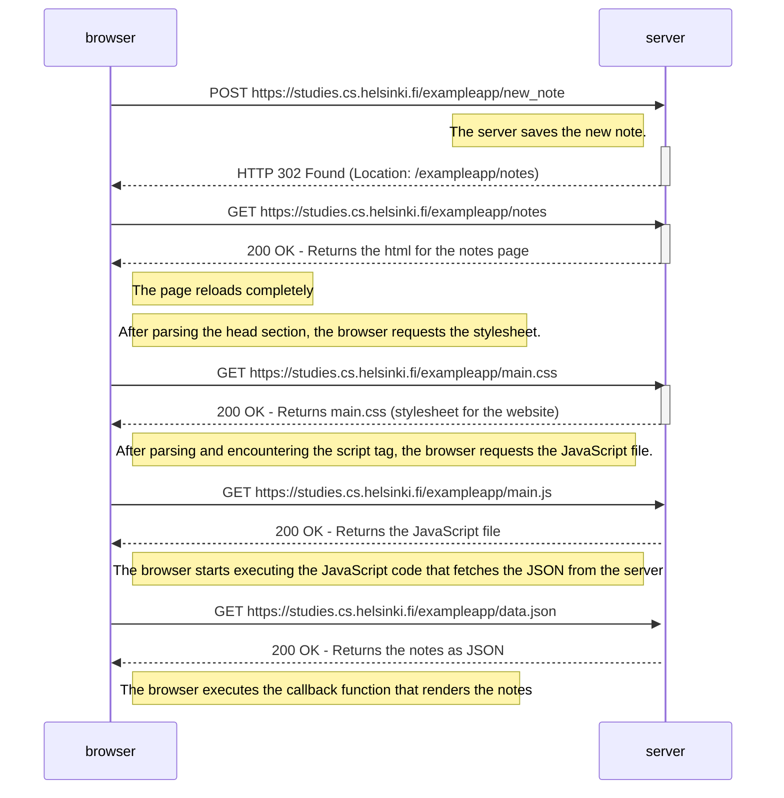

```mermaid
sequenceDiagram
    participant browser
    participant server
    
    browser->>server: POST https://studies.cs.helsinki.fi/exampleapp/new_note
    Note left of server: The server saves the new note.
    activate server
    server-->>browser: HTTP 302 Found (Location: /exampleapp/notes)
    deactivate server
    
    browser->>server: GET https://studies.cs.helsinki.fi/exampleapp/notes
    activate server
    server-->>browser: 200 OK - Returns the html for the notes page
    deactivate server
    Note right of browser: The page reloads completely

    Note right of browser: After parsing the head section, the browser requests the stylesheet.
    browser->>server: GET https://studies.cs.helsinki.fi/exampleapp/main.css
    activate server
    server-->>browser: 200 OK - Returns main.css (stylesheet for the website)
    deactivate server
    
    Note right of browser: After parsing and encountering the script tag, the browser requests the JavaScript file.
    browser->>server: GET https://studies.cs.helsinki.fi/exampleapp/main.js
    activate server
    server-->>browser: 200 OK - Returns the JavaScript file

     Note right of browser: The browser starts executing the JavaScript code that fetches the JSON from the server
     browser->>server: GET https://studies.cs.helsinki.fi/exampleapp/data.json
    server-->>browser: 200 OK - Returns the notes as JSON

    Note right of browser: The browser executes the callback function that renders the notes 
```
