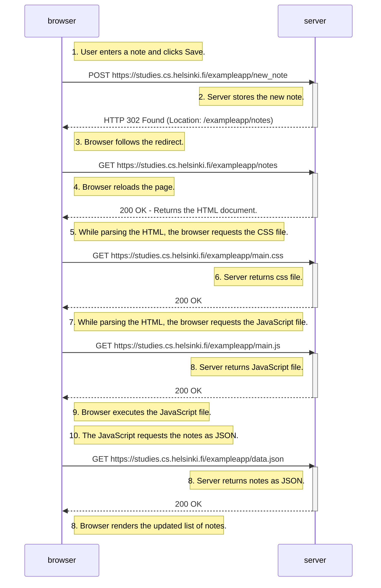

```mermaid
sequenceDiagram
    participant browser
    participant server

    Note right of browser: 1. User enters a note and clicks Save.
    browser->>server: POST https://studies.cs.helsinki.fi/exampleapp/new_note
    activate server
    Note left of server: 2. Server stores the new note.
    server-->>browser: HTTP 302 Found (Location: /exampleapp/notes)
    deactivate server

     Note right of browser: 3. Browser follows the redirect.
    browser->>server: GET https://studies.cs.helsinki.fi/exampleapp/notes
    
    activate server
    Note right of browser: 4. Browser reloads the page.
    server-->>browser: 200 OK - Returns the HTML document.
    deactivate server
    

    Note right of browser: 5. While parsing the HTML, the browser requests the CSS file.
    browser->>server: GET https://studies.cs.helsinki.fi/exampleapp/main.css
    activate server
    Note left of server: 6. Server returns css file.
    server-->>browser: 200 OK
    deactivate server

    Note right of browser: 7. While parsing the HTML, the browser requests the JavaScript file.
    browser->>server: GET https://studies.cs.helsinki.fi/exampleapp/main.js
    activate server
    Note left of server: 8. Server returns JavaScript file.
    server-->>browser: 200 OK
    deactivate server

    Note right of browser: 9. Browser executes the JavaScript file.
    Note right of browser: 10. The JavaScript requests the notes as JSON.
    browser->>server: GET https://studies.cs.helsinki.fi/exampleapp/data.json
    activate server
    Note left of server: 8. Server returns notes as JSON.
    server-->>browser: 200 OK
    deactivate server

    Note right of browser: 8. Browser renders the updated list of notes.
```
