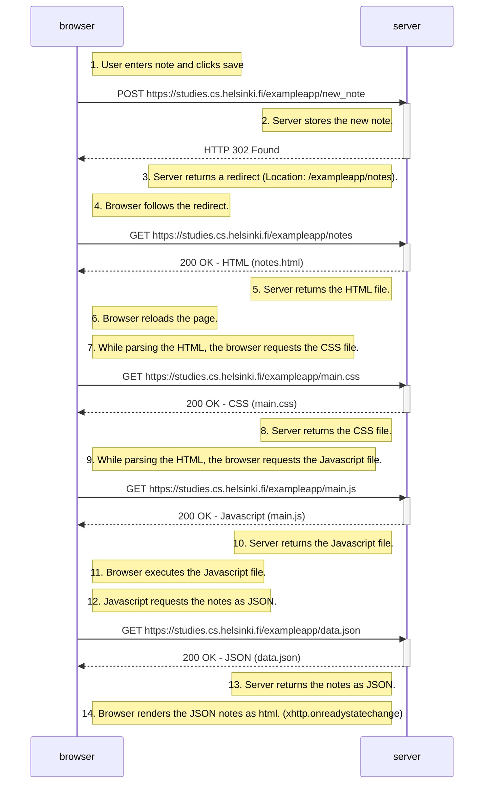

```mermaid
sequenceDiagram
    participant browser
    participant server

    Note right of browser: 1. User enters note and clicks save
    browser->>server: POST https://studies.cs.helsinki.fi/exampleapp/new_note
    activate server
    Note left of server: 2. Server stores the new note.
    server-->>browser: HTTP 302 Found
    deactivate server
    Note left of server: 3. Server returns a redirect (Location: /exampleapp/notes).

    Note right of browser: 4. Browser follows the redirect.
    browser->>server: GET https://studies.cs.helsinki.fi/exampleapp/notes
    activate server
    server-->>browser: 200 OK - HTML (notes.html)
    deactivate server
    Note left of server: 5. Server returns the HTML file.

    Note right of browser: 6. Browser reloads the page.

    Note right of browser: 7. While parsing the HTML, the browser requests the CSS file.
    browser->>server: GET https://studies.cs.helsinki.fi/exampleapp/main.css
    activate server
    server-->>browser: 200 OK - CSS (main.css)
    deactivate server
    Note left of server: 8. Server returns the CSS file.

    Note right of browser: 9. While parsing the HTML, the browser requests the Javascript file.
    browser->>server: GET https://studies.cs.helsinki.fi/exampleapp/main.js
    activate server
    server-->>browser: 200 OK - Javascript (main.js)
    deactivate server
    Note left of server: 10. Server returns the Javascript file.

    Note right of browser: 11. Browser executes the Javascript file.

    Note right of browser: 12. Javascript requests the notes as JSON.
    browser->>server: GET https://studies.cs.helsinki.fi/exampleapp/data.json
    activate server
    server-->>browser: 200 OK - JSON (data.json)
    deactivate server
    Note left of server: 13. Server returns the notes as JSON.

    Note right of browser: 14. Browser renders the JSON notes as html. (xhttp.onreadystatechange)
```
