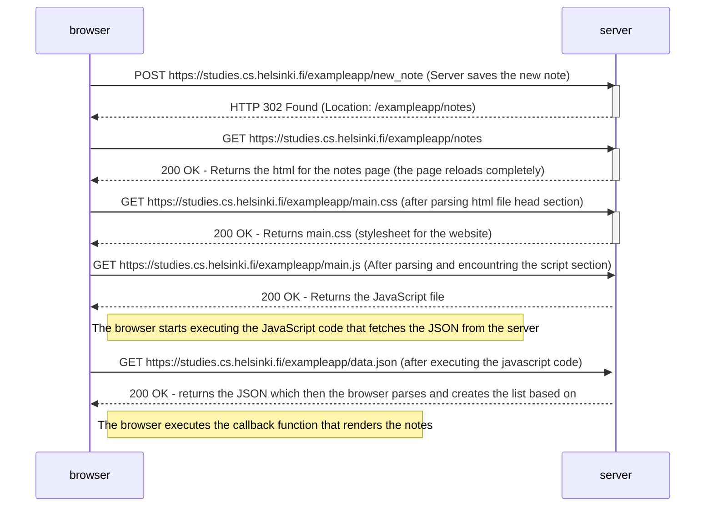

```mermaid
sequenceDiagram
    participant browser
    participant server
    
    browser->>server: POST https://studies.cs.helsinki.fi/exampleapp/new_note (Server saves the new note)
    activate server
    server-->>browser: HTTP 302 Found (Location: /exampleapp/notes)
    deactivate server
    
    browser->>server: GET https://studies.cs.helsinki.fi/exampleapp/notes
    activate server
    server-->>browser: 200 OK - Returns the html for the notes page (the page reloads completely)
    deactivate server
    
    browser->>server: GET https://studies.cs.helsinki.fi/exampleapp/main.css (after parsing html file head section)
    activate server
    server-->>browser: 200 OK - Returns main.css (stylesheet for the website)
    deactivate server
    
   
    browser->>server: GET https://studies.cs.helsinki.fi/exampleapp/main.js (After parsing and encountring the script section)
    activate server
    server-->>browser: 200 OK - Returns the JavaScript file

     Note right of browser: The browser starts executing the JavaScript code that fetches the JSON from the server
     browser->>server: GET https://studies.cs.helsinki.fi/exampleapp/data.json (after executing the javascript code)
    server-->>browser: 200 OK - returns the JSON which then the browser parses and creates the list based on

    Note right of browser: The browser executes the callback function that renders the notes 
```
