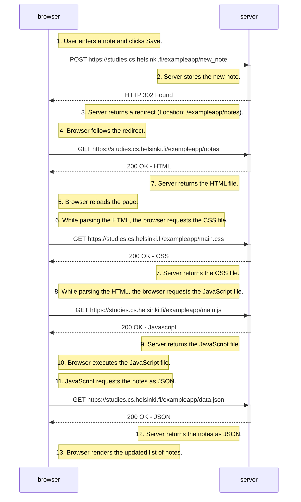

```mermaid
sequenceDiagram
    participant browser
    participant server

    Note right of browser: 1. User enters a note and clicks Save.
    browser->>server: POST https://studies.cs.helsinki.fi/exampleapp/new_note
    activate server
    Note left of server: 2. Server stores the new note.
    server-->>browser: HTTP 302 Found
    deactivate server
    Note left of server: 3. Server returns a redirect (Location: /exampleapp/notes).

    Note right of browser: 4. Browser follows the redirect.
    browser->>server: GET https://studies.cs.helsinki.fi/exampleapp/notes
    activate server
    server-->>browser: 200 OK - HTML
    deactivate server
    Note left of server: 7. Server returns the HTML file.

    Note right of browser: 5. Browser reloads the page.

    Note right of browser: 6. While parsing the HTML, the browser requests the CSS file.
    browser->>server: GET https://studies.cs.helsinki.fi/exampleapp/main.css
    activate server
    server-->>browser: 200 OK - CSS
    deactivate server
    Note left of server: 7. Server returns the CSS file.

    Note right of browser: 8. While parsing the HTML, the browser requests the JavaScript file.
    browser->>server: GET https://studies.cs.helsinki.fi/exampleapp/main.js
    activate server
    server-->>browser: 200 OK - Javascript
    deactivate server
    Note left of server: 9. Server returns the JavaScript file.

    Note right of browser: 10. Browser executes the JavaScript file.

    Note right of browser: 11. JavaScript requests the notes as JSON.
    browser->>server: GET https://studies.cs.helsinki.fi/exampleapp/data.json
    activate server
    server-->>browser: 200 OK - JSON
    deactivate server
    Note left of server: 12. Server returns the notes as JSON.

    Note right of browser: 13. Browser renders the updated list of notes.
```
