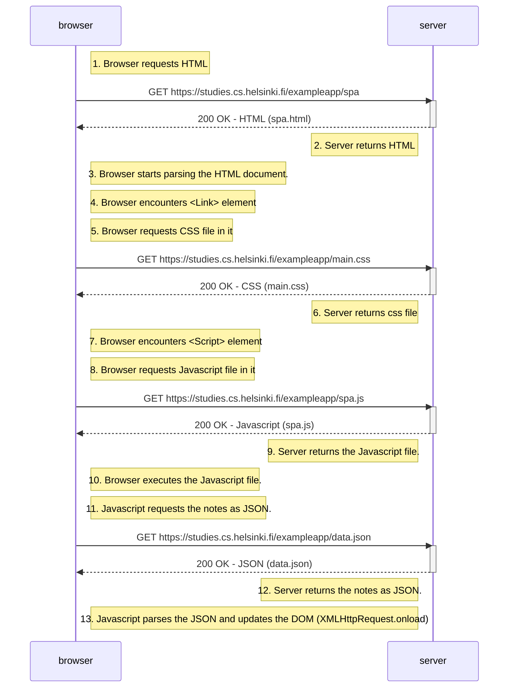

```mermaid
sequenceDiagram
    participant browser
    participant server

    Note right of browser: 1. Browser requests HTML
    browser->>server: GET https://studies.cs.helsinki.fi/exampleapp/spa
    activate server
    server-->>browser: 200 OK - HTML (spa.html)
    deactivate server
    Note left of server: 2. Server returns HTML
    Note right of browser: 3. Browser starts parsing the HTML document.
    Note right of browser: 4. Browser encounters <Link> element
    Note right of browser: 5. Browser requests CSS file in it
    browser->>server: GET https://studies.cs.helsinki.fi/exampleapp/main.css
    activate server
    server-->>browser: 200 OK - CSS (main.css)
    deactivate server
    Note left of server: 6. Server returns css file
    Note right of browser: 7. Browser encounters <Script> element
    Note right of browser: 8. Browser requests Javascript file in it
    browser->>server: GET https://studies.cs.helsinki.fi/exampleapp/spa.js
    activate server
    server-->>browser: 200 OK - Javascript (spa.js)
    deactivate server
    Note left of server: 9. Server returns the Javascript file.
    Note right of browser: 10. Browser executes the Javascript file.
    Note right of browser: 11. Javascript requests the notes as JSON.
    browser->>server: GET https://studies.cs.helsinki.fi/exampleapp/data.json
    activate server
    server-->>browser: 200 OK - JSON (data.json)
    deactivate server
    Note left of server: 12. Server returns the notes as JSON.

    Note right of browser: 13. Javascript parses the JSON and updates the DOM (XMLHttpRequest.onload)
```
