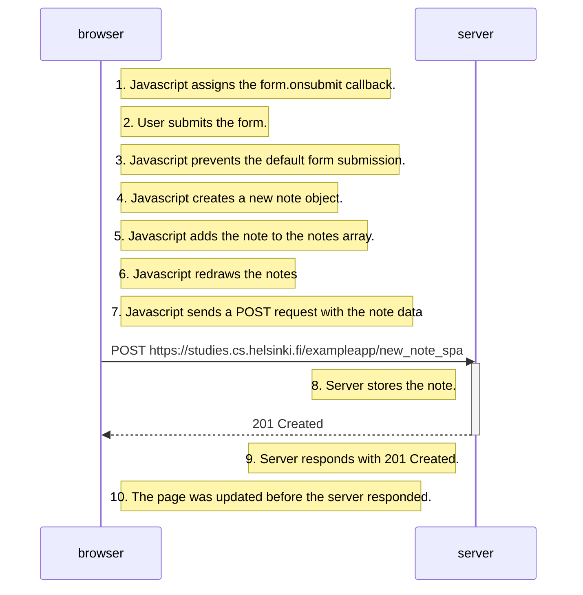

```mermaid
sequenceDiagram
    participant browser
    participant server

    Note right of browser: 1. Javascript assigns the form.onsubmit callback.
    Note right of browser: 2. User submits the form.
    Note right of browser: 3. Javascript prevents the default form submission.
    Note right of browser: 4. Javascript creates a new note object.
    Note right of browser: 5. Javascript adds the note to the notes array.
    Note right of browser: 6. Javascript redraws the notes
    Note right of browser: 7. Javascript sends a POST request with the note data
    browser->>server: POST https://studies.cs.helsinki.fi/exampleapp/new_note_spa
    activate server
    Note left of server: 8. Server stores the note.
    server-->>browser: 201 Created
    deactivate server
    Note left of server: 9. Server responds with 201 Created.
    Note right of browser: 10. The page was updated before the server responded.
```
