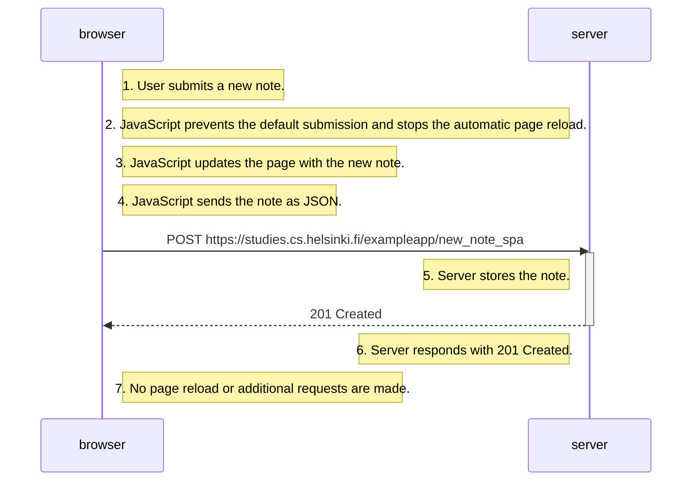

```mermaid
sequenceDiagram
    participant browser
    participant server

    Note right of browser: 1. User submits a new note.
    Note right of browser: 2. JavaScript prevents the default submission and stops the automatic page reload.
    Note right of browser: 3. JavaScript updates the page with the new note.
    Note right of browser: 4. JavaScript sends the note as JSON.
    browser->>server: POST https://studies.cs.helsinki.fi/exampleapp/new_note_spa
    activate server
    Note left of server: 5. Server stores the note.
    server-->>browser: 201 Created
    deactivate server
    Note left of server: 6. Server responds with 201 Created.
    Note right of browser: 7. No page reload or additional requests are made.
```
